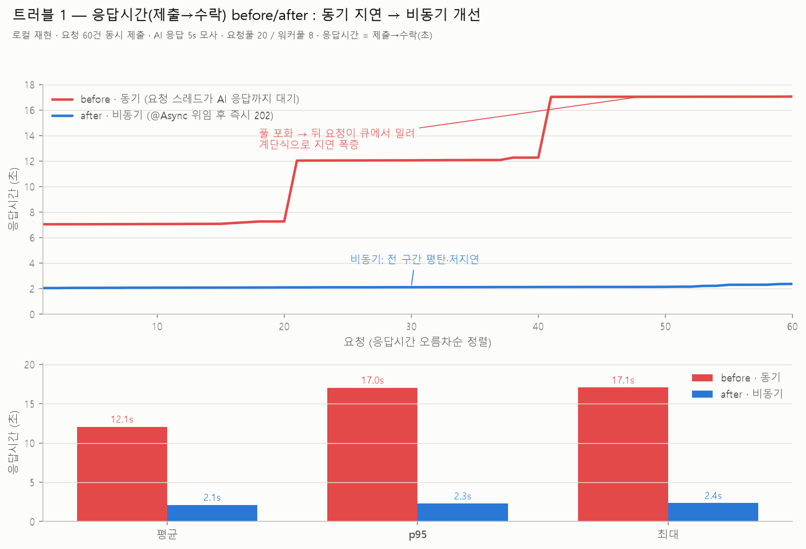
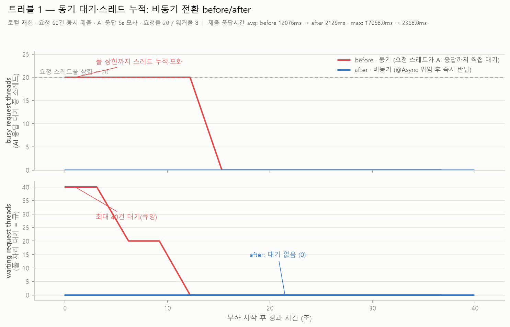

# 트러블 1 — 동기 대기·스레드 누적 → 비동기 전환 before/after 재현

동기식 요청 처리에서 요청 스레드가 AI 응답(3~10초)까지 **직접 블로킹되어 누적**되던 문제를,
`@Async` 위임(비동기)으로 해소한 효과를 정량 재현한 실측이다.
(트러블 2 [`phase8-hikaricp`](../phase8-hikaricp/)와 동일한 방식 — 느린 AI 응답 조건을 고정하고 지표를 1초 간격 폴링)

## 응답시간(제출→수락) before/after — 개발 동기: "동기 지연 → 비동기 개선"



단독(발표용, y축 동일 고정): [before](async-latency-before.png) · [after](async-latency-after.png) — 생성: `make_latency_charts.py`

| 응답시간 | before · 동기 | after · 비동기 |
|---|---|---|
| 평균 | ~12.1s | ~2.1s |
| p95 | ~17.0s | ~2.3s |
| 최대 | ~17.1s | ~2.4s |

동기 처리에선 요청 스레드풀(20)이 포화되면 뒤 요청이 큐에서 밀려 **계단식(7s→12s→17s)** 으로 지연이 폭증한다.
비동기 전환 후엔 즉시 202로 수락되어 전 구간 평탄·저지연.
> ⚠️ after의 절대값(~2s)은 부하 생성기(파이썬 60스레드)의 GIL 경합이 포함된 값 — 실제 백엔드는 수십 ms. 핵심은 **계단식 폭증의 소멸**.

---

## 스레드 점유 관점 (동일 실험, 원인 규명)



## 결론

| | before · 동기 | after · 비동기 |
|---|---|---|
| `busy_request_threads` (AI 응답 대기 중 요청 스레드) | **요청 스레드풀 상한(20)까지 누적·포화** (~12초 지속) | **전 구간 0** (즉시 반납) |
| `waiting_request_threads` (풀 자리 대기 = 큐) | **최대 40건 대기(큐잉)** | **0** |
| 제출→수락 지연 (동시 60건) | avg ~12.1s / max ~17s | avg ~2.1s / max ~2.4s |

**메커니즘**
- **before(동기)**: 요청 스레드(Tomcat http-nio 축소판)가 AI HTTP 호출 응답까지 스레드를 **직접 점유**.
  동시 요청이 풀(20)을 넘으면 스레드가 상한까지 차오르고(누적) 나머지는 큐에서 대기 → 타임아웃·지연.
- **after(비동기)**: 요청 스레드는 작업을 `aiWorkerExecutor`(최대 8) 워커풀로 넘기고 **즉시 202 반환** →
  요청 스레드는 곧바로 반납되어 `busy_request_threads ≈ 0`. 분석은 워커풀에서 병렬 처리.

> ⚠️ after의 "제출 지연 ~2.1s"는 서버가 아니라 **부하 생성기(순수 파이썬 60스레드)의 GIL 경합 아티팩트**다.
> 서버 관점의 핵심 근거는 `busy_request_threads` = 0 (요청 스레드 즉시 반납)이며, 실제 백엔드는 202를 수십 ms에 반환한다.

## 측정 환경

- 로컬 PC (Windows 11), 재현 서버 `app_server.py` (포트 8090)
- **AI 응답 5초 모사** (`AI_DELAY`) — 실제 GPT 3~10초를 고정값으로 대체
- 요청 스레드풀 상한 `REQ_POOL=20` (Tomcat maxThreads 축소판) · 비동기 워커풀 `WORKER_MAX=8` (= aiWorkerExecutor)
- 부하: 분석 제출 **60건 동시 버스트** (`load.py`) — 풀(20)을 넘겨 누적·큐잉을 유발
- 관측: `poll_threads.py` 가 `/metrics` 를 1초 간격 폴링 → `data/*.csv`

## 재현 절차

### 한 번에 (권장)
```bash
python run_all.py
# → data/threads_sync.csv, threads_async.csv, load_*.csv 생성 후
#   async-thread-accumulation-before-after.png 자동 생성
# 파라미터 조정: AI_DELAY=8 REQ_POOL=30 BURST=100 POLL_S=60 python run_all.py
```

### 수동 (모드별)
```bash
# 1) 동기 서버
MODE=sync PORT=8090 REQ_POOL=20 AI_DELAY=5 python app_server.py
# 2) 폴러 + 부하
python poll_threads.py data/threads_sync.csv 45 http://localhost:8090/metrics
python load.py 60 http://localhost:8090/submit data/load_sync.csv
# 3) async 모드로 서버 재기동 후 위 2)를 threads_async / load_async 로 반복
# 4) 차트
python make_chart.py
```

### 실제 백엔드로 측정 (선택 — 신뢰도 최상)
재현 서버 대신 실제 Spring 백엔드의 `/actuator/prometheus`를 폴링한다.
동기(before) 상태는 요청을 동기 호출하는 임시 엔드포인트/브랜치가 필요하다.
```bash
python poll_threads.py data/threads_sync.csv 60 http://<host>:8080/actuator/prometheus --real
# --real: tomcat_threads_busy_threads / jvm_threads_states{timed-waiting}
#         / executor_active_threads{aiWorkerExecutor} 를 대신 수집
```

## 파일
| 파일 | 역할 |
|------|------|
| `app_server.py` | 동기/비동기 요청 처리 재현 서버 (`MODE` 환경변수) |
| `load.py` | 분석 제출 동시 버스트 부하 생성기 |
| `poll_threads.py` | 스레드 점유 지표 1초 폴러 (재현 서버/실백엔드 겸용) |
| `make_chart.py` | 스레드 점유 before/after 비교 차트 생성 |
| `make_latency_charts.py` | 응답시간 before/after 차트 (합본 + 단독 2장) 생성 |
| `run_all.py` | 전체 오케스트레이터 (원샷 — 두 종류 차트 모두 생성 가능) |

관련: [`docs/benchmark-method.md`](../../docs/benchmark-method.md), [`phase8-hikaricp`](../phase8-hikaricp/), REFACTORING_PLAN.md
