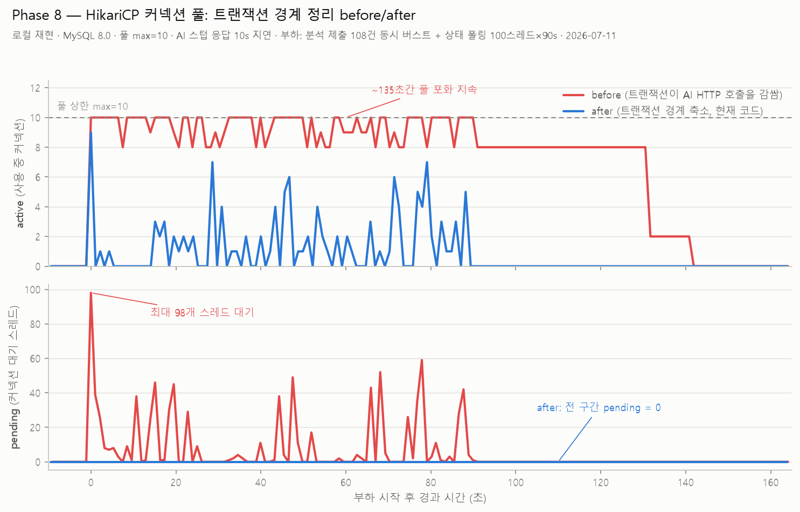

# Phase 8 — HikariCP 커넥션 풀 before/after 로컬 재현 (2026-07-11)

트랜잭션 경계 정리(커밋 `9314f69`)의 효과를 정량 입증하기 위한 로컬 재현 실측.



단독 차트(발표용, 두 장의 y축 스케일 동일 고정): [before](phase8-hikaricp-before.png) · [after](phase8-hikaricp-after.png) — 생성: `make_single_charts.py`

## 결론

| | before (`9314f69` 이전) | after (현재 코드) |
|---|---|---|
| `hikaricp_connections_active` | **10(풀 상한)에 ~135초간 고정** | 버스트 순간 9 찍고 즉시 반납 |
| `hikaricp_connections_pending` | **최대 98**, 평균 6.1 | **전 구간 0** |
| 제출 응답시간 (108건 동시) | avg 919ms / p95 997ms | avg 675ms / p95 725ms |
| 상태 폴링 (100스레드×90s) | avg 23ms / p95 79ms | avg 14ms / p95 33ms |

**메커니즘**: before에서는 `AiWorkerClient.submitAnalysis`가 `@Async + @Transactional`이라
aiWorkerExecutor 스레드 8개가 AI `/analyze` HTTP 응답(10s)을 기다리는 내내 DB 커넥션 8개를 점유
→ 풀(10)에 2개만 남아 다른 모든 DB 작업이 경합. after는 상태 UPDATE만 짧은 독립 트랜잭션
(`ArticleStatusWriter`, REQUIRES_NEW)으로 처리하고 HTTP는 트랜잭션 밖 → 점유 없음.

## 측정 환경

- 로컬 PC (Windows 11), MySQL 8.0.44 (localhost), HikariCP maximum-pool-size=10 (기본값)
- 백엔드 8081 포트, before = `9314f69~1`(=`872ee67`) 빌드, after = 현재 HEAD 빌드
- AI 엔진 대신 **느린 스텁**(`ai_stub.py`, 응답 전 10s sleep) — 옛 Flask 동기 `/analyze`(~14s)를 모사
  - 현재 FastAPI 엔진은 202 즉시 반환이라 원 결함이 재현되지 않으므로 스텁으로 "느린 AI 응답" 조건을 고정
- 부하 (`load.py`): ① 분석 제출 108건 동시 버스트(= aiWorkerExecutor 수용량: max 8 스레드 + 큐 100)
  ② 상태 폴링 GET `/{id}/status` 100스레드 × 90초 (프론트 폴링 모사)
- 관측 (`poll_metrics.py`): `/actuator/prometheus`를 1초 간격 폴링 → `data/*.csv`

## 재현 절차

```powershell
# 1. AI 스텁 (10s 지연)
$env:AI_STUB_DELAY="10"; python ai_stub.py

# 2. 백엔드 기동 (before는 git worktree로 9314f69~1 체크아웃 후 bootJar 빌드)
java -jar build\libs\factcheck-0.0.1-SNAPSHOT.jar --server.port=8081 --ai.server.url=http://localhost:5000

# 3. 지표 기록 + 부하
python poll_metrics.py hikari_before.csv 200   # 백그라운드
python load.py 108 100 90 load_before.csv

# 4. 차트
python make_chart.py phase8-hikaricp-before-after.png
```

관련 문서: [`docs/benchmark-method.md`](../../docs/benchmark-method.md), REFACTORING_PLAN.md Phase 8
